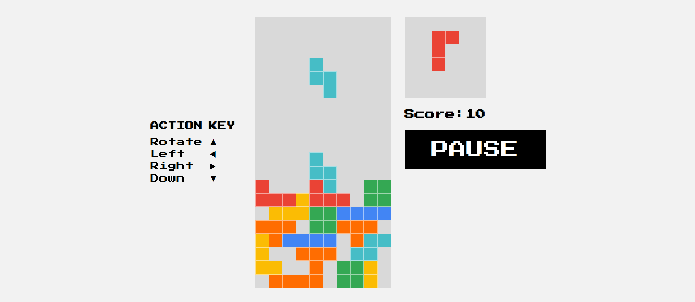

- [Overview](#overview)
  - [Screenshot](#screenshot)
  - [Links](#links)
- [My process](#my-process)
  - [Built with](#built-with)
  - [What I learned](#what-i-learned)
  - [Continued development](#continued-development)

### Overview
This is my portfolio project aiming to reproduce a famous Tetris Game in JavaScript. A user can slide blocks left, right, down, and rotate them. Once there is a full line it disappears and a user gets 10 points. A user can preview the next block in a mini-grid aside. I also created a version for mobile where a user can navigate blocks by clicking on buttons. 

### Screenshot

### Links

- Live Site URL: [https://tourmaline-panda-21fdd9.netlify.app/]

## My process

### Built with
- JavaScript
  - addEventListener()
  - querySelector()
  - querySelectorAll()
  - keyCode()
  - Math.floor()
  - Math.random()
  - length
  - forEach()
  - splice()
  - clearInterval()
  - setInterval()
  - some()
  - innerHTML()
  - every()
  - add()
  - remove()
  - contains()
- HTML
- CSS 

### What I learned

I have practiced working with arrays, creating random numbers, appending elements to HTML, adding and removing CSS classes, settings and removing intervals, working with loops and functions, events listeners, and key-down events.

### Continued development

The game could be improved by adding line counts, levels, music, and visual animations. 
